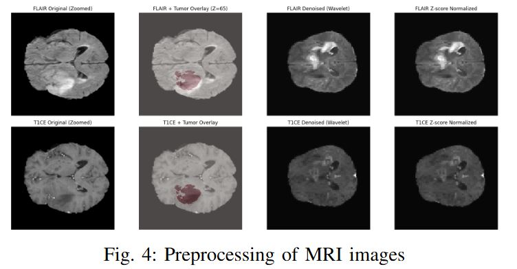
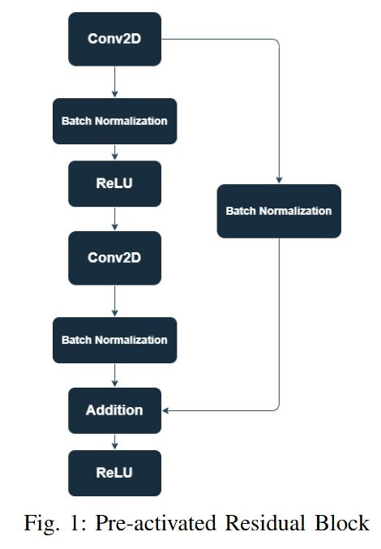
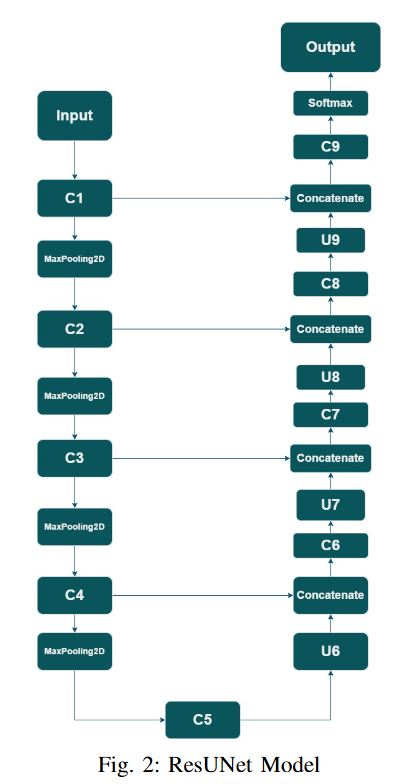
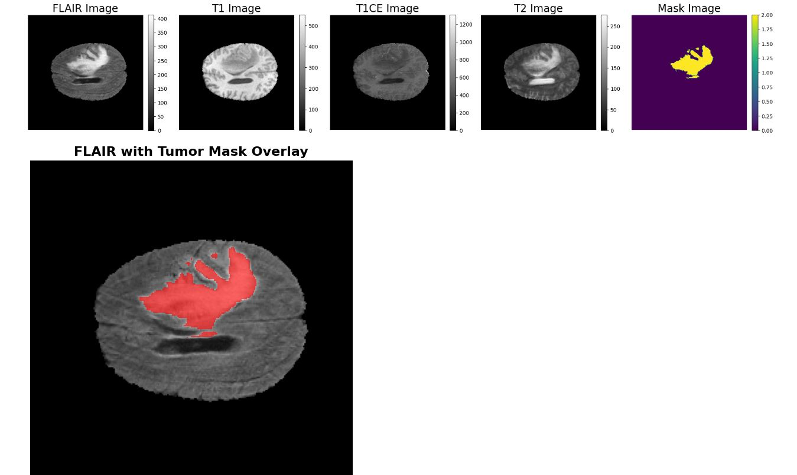
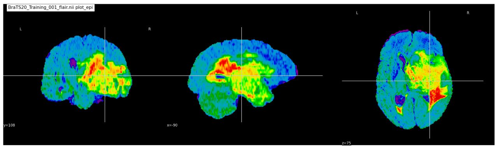
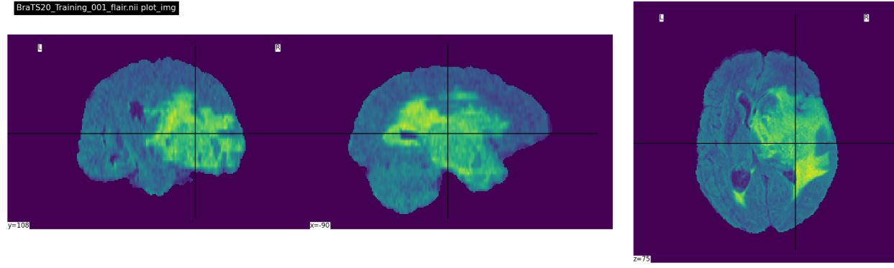
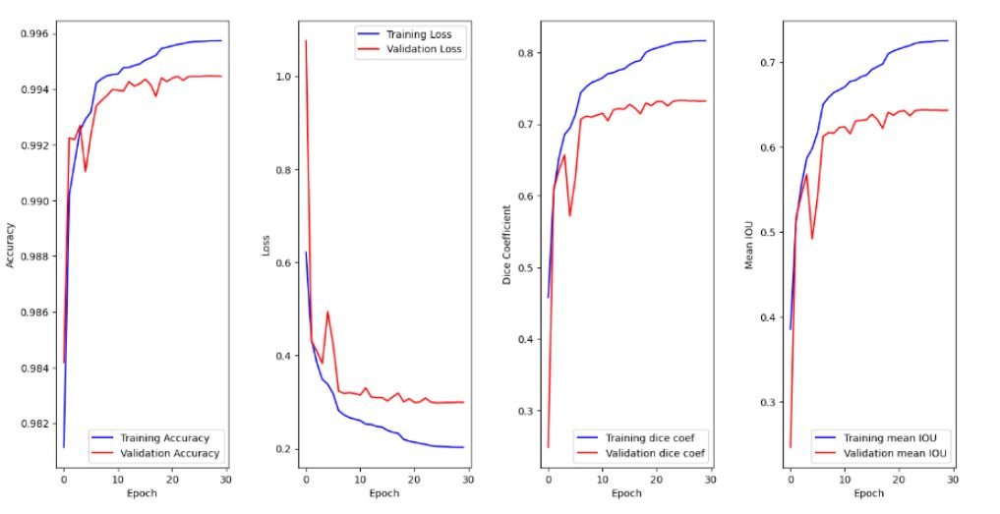

# 🧠 OncoScan-AI: Residual U-Net with Wavelet Denoising for Brain Tumor Segmentation

## 🔍 Project Overview

This repository presents **OncoWaveNet**, a novel medical image segmentation framework that combines:
- **Residual U-Net architecture**
- **Wavelet-based denoising**
- **Tumor-centric slice sampling**
- **Hybrid loss optimization**

Trained on the [BraTS 2020 Dataset](https://www.med.upenn.edu/cbica/brats2020/data.html), the model focuses on accurate segmentation of:
- 🟥 **Enhancing Tumor (ET)**
- 🟨 **Tumor Core (TC)**
- 🟩 **Whole Tumor (WT)**

---

## 📌 Objectives

- 🎯 Automate segmentation of brain tumor subregions in multimodal MRI scans.
- 🧼 Reduce noise and preserve structural features using wavelet denoising.
- 📐 Use a hybrid loss (Dice + Categorical Crossentropy) to improve boundary accuracy.
- 🧠 Enable efficient training under constrained hardware.

---

## 🧠 Key Features

- ✅ **Residual U-Net (ResUNet)** backbone for deep feature learning.
- ✅ **Wavelet Denoising** using Daubechies-1 (Haar) filters for noise suppression.
- ✅ **Z-axis slice sampling** centered on tumor for high focus and reduced data redundancy.
- ✅ **Class remapping + One-hot encoding** for multi-class segmentation.
- ✅ Fully compatible with [BraTS 2020](https://www.med.upenn.edu/cbica/brats2020/) standardized annotations.

---

## 🛠 Tech Stack

| Category              | Tools / Libraries                              |
|-----------------------|-------------------------------------------------|
| Language              | Python 3.8+                                     |
| Deep Learning         | PyTorch, TensorFlow, Keras                      |
| Medical Imaging       | NiBabel, SimpleITK, OpenCV                      |
| Data Handling         | NumPy, Pandas, Matplotlib, Seaborn              |
| Optimization          | Adam Optimizer, ReduceLROnPlateau              |
| Evaluation            | Dice Coefficient, IoU, Accuracy, Precision, etc |
| Development           | Jupyter Notebook, Google Colab, VS Code         |
| Version Control       | Git, GitHub                                     |

---

## ⚙️ Preprocessing Pipeline

> Implemented using `SimpleITK`, `PyWavelets`, `NumPy`, and custom utilities.

1. **Tumor Slice Extraction:**  
   Extract 100 axial slices centered around tumor Z-location for focused training.

2. **Wavelet Denoising:**  
   Apply Haar wavelet transform to FLAIR & T1ce slices to suppress background noise.

3. **Z-score Normalization:**  
   Normalize pixel intensities to zero-mean, unit variance per slice.

4. **Label Remapping & Encoding:**  
   Convert label `4 → 3` and apply one-hot encoding to segment ET, TC, WT.

5. **Resizing:**  
   Resize all slices to uniform spatial dimensions (e.g., 240×240).

   

---

## 🧱 Model Architecture

**Residual U-Net** combines the U-Net encoder-decoder structure with **residual blocks** to improve gradient flow and feature reuse.  
Skip connections preserve spatial resolution and fine features crucial for medical segmentation.

📌 *Block Overview:*

- Encoder: 4 residual downsampling blocks (C1–C4)
- Bottleneck: Deepest abstract features (C5)
- Decoder: 4 residual upsampling blocks with skip connections (C6–C9)
- Output: 1×1 convolution with softmax to predict segmentation classes

> Residual Block = (Conv → BN → ReLU → Conv → BN) + Shortcut

---

## 🧪 Dataset: BraTS 2020

- 369 patients: 259 High Grade Gliomas (HGG), 110 Low Grade (LGG)
- MRI modalities: **T1**, **T1ce**, **T2**, **FLAIR**
- Voxel-wise labels: 0 = Background, 1 = Necrosis, 2 = Edema, 4 = Enhancing Tumor
- All images registered to 240×240×155 with 1mm³ resolution

---

## 📊 Results

| Metric     | ET        | TC        | WT        |
|------------|-----------|-----------|-----------|
| Dice       | 0.7779    | 0.8789    | 0.8920    |

| Overall Performance | Value     |
|---------------------|-----------|
| Accuracy            | 99.58%    |
| Precision           | 99.58%    |
| Sensitivity         | 99.58%    |
| Specificity         | 99.86%    |

📉 See `results/metrics.png` and `results/graphs/` for training curves and evaluation plots.

---

## 📷 Evaluation Graphs

---

## 🔮 Future Work

- 📈 Extend to **3D ResUNet** or 2.5D hybrid models for volumetric consistency
- 🧩 Add **attention mechanisms** (e.g., SE blocks, Transformers)
- 🎨 Visualize segmentation overlays with ITK-SNAP or 3D Slicer
- 🧬 Integrate **Generative AI** (LDM) for tumor progression prediction
- 📝 Use **LLMs** (GPT-4) + Jinja2 for automatic radiology report generation

---

## 🧑‍💻 Authors

- **Shaikh Asif Hossain**  
  B.Tech, Calcutta Institute of Engineering & Management  
  📧 [hossainshaikhasif@gmail.com](mailto:hossainshaikhasif@gmail.com)  
  🌐 [GitHub](https://github.com/asifhossain12)

- **Surojit Bose**  
  B.Tech, Calcutta Institute of Engineering & Management
  📧 [surojitbose2002@gmail.com](mailto:surojitbose2002@gmail.com)  

- **Debam Saha**  
  Assistant Professor, Department of CSE, CIEM
  📧 [debamsaha@ciem.co.in](mailto:debamsaha@ciem.co.in)

---

## 📄 License

This repository is licensed under the MIT License.  
Feel free to use, adapt, or extend with attribution.

## ⭐ Support

If you find this project helpful, please ⭐ star the repository and share it with your peers!
